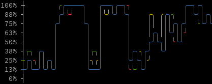

# visys

Visualize system resources

## Installation

```bash
npm i -g visys
```

## Commands

`vi-mem` or `vimem` to show memory usage over time

Sample output:

```
  19.2GB ┼
  17.1GB ┤                    ╭──╮
  15.0GB ┤               ╭────╯  ╰─╮ ╭──╮
  12.8GB ┤           ╭───╯         ╰─╯  ╰╮
  10.7GB ┤       ╭───╯                   ╰─╮
   8.5GB ┼───────╯                         ╰──
   6.4GB ┤
   4.3GB ┤
   2.1GB ┤
      0B ┤
```

`vi-cpu` or `vicpu` to show cpu (each core) usage over time

Sample output:

```
100% ┼             ╭────────╮
 86% ┤             │╰╯   ╰╯ │
 71% ┤            ╭╯        │
 57% ┤            │         ╰╮    ╭╮   ╭╮
 43% ┤      ╭╮    │          │    ││ ╭╮││
 29% ┼╮  ╭╮╭╮╭───╮│          │╭╮─╮╭╮╭╮╭╯╰──
 14% ┼─────╯╰╯─╯─╰╯          ╰────╯╰╯╰╯─╯╯
  0% ┤
```


## Keyboard Shortcuts

`q` or `Q` to quit

`r` or `R` to reset the data

## License

This project is licensed with [BSD-2-Clause](./LICENSE)

This is free, libre, and open-source software. It comes down to four essential freedoms [[ref]](https://seirdy.one/2021/01/27/whatsapp-and-the-domestication-of-users.html#fnref:2):

- The freedom to run the program as you wish, for any purpose
- The freedom to study how the program works, and change it so it does your computing as you wish
- The freedom to redistribute copies so you can help others
- The freedom to distribute copies of your modified versions to others
